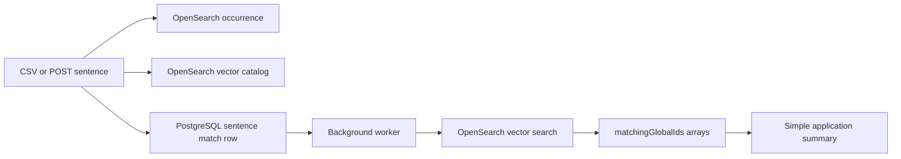

# Semantic Sentence Matching

This is a standalone API. Everything needed by this project is inside this
folder.

It uses:

- OpenSearch for sentence documents and 512-dimension Titan vectors.
- PostgreSQL for ready-to-read matching ID lists and application totals.
- A background worker so the seed request does not wait for every vector
  search.

## Simple data flow



Every sentence, including tracer and form-language text, is saved in
OpenSearch and gets a vector. Tracer and form-language rows are marked
`skipped`, so they never match another sentence and never increase a summary.

Normal sentences only match sentences with the same `analysisGroup`. By
default, application APIs use `Asylee`.

The default also prevents sentences inside the same application from matching:

```text
MATCH_ACROSS_APPLICATIONS_ONLY=true
```

## OpenSearch indexes

### `sentence_occurrences`

This index stores every sentence and its metadata:

```text
applicationId
tspId
documentId
sectionName
globalId
sentIdLocal
sentenceContent
isTracer
isFormLanguage
sentenceKey
sourceType
createdAt
updatedAt
analysisGroup
```

### `sentence_semantic_catalog`

This index stores one vector for each unique normalized sentence:

```text
sentenceContent
sentenceContentVector
sentenceKey
createdAt
updatedAt
```

The vector mapping uses:

```text
dimension: 512
engine: faiss
method: hnsw
space_type: cosinesimil
```

## Only two PostgreSQL tables

### `sentence_matches`

The important columns are:

```text
globalId
tspId
applicationId
sectionName
analysisGroup
matchingGlobalIds
```

Example rows:

```text
globalId 1  -> matchingGlobalIds [10, 40]
globalId 10 -> matchingGlobalIds [1, 40]
globalId 40 -> matchingGlobalIds [1, 10]
```

The same row also has a few worker fields such as `matchStatus` and
`matchAttempts`. They allow matching to continue after the worker or AWS
session restarts. A separate queue table is not needed.

### `application_match_summary`

There is one row for each application and analysis group. It contains only:

```text
applicationId
analysisGroup
sectionMatchCounts
totalMatching
updatedAt
```

Example:

```json
{
  "applicationId": "A0001",
  "analysisGroup": "Asylee",
  "totalMatching": 40,
  "sectionMatches": [
    {"sectionName": "Affidavit", "matchingCount": 10},
    {"sectionName": "B1", "matchingCount": 30}
  ]
}
```

The UI reads this one row. It does not count all matches during the request.

## How connected matching works

The worker first finds direct OpenSearch results that pass the configured
threshold. The default is 90%.

The saved arrays are then expanded as one connected group. Example:

```text
1 matches 10 and 40
10 later directly matches 78
```

The group becomes:

```text
1  -> [10, 40, 78]
10 -> [1, 40, 78]
40 -> [1, 10, 78]
78 -> [1, 10, 40]
```

Important: this is a connected group. It does not mean every inherited pair
was directly measured at 90%. For example, 1 and 78 may be connected through
10 even when their own score is lower than 90%.

This format is simple to read, but it duplicates IDs. A group containing N
sentences stores N × (N - 1) IDs. Very large connected groups can therefore use
a lot of PostgreSQL storage.

## Prepare the Titan pipeline

The registered OpenSearch model must return 512 values.

```json
PUT /_ingest/pipeline/sentence_bedrock_embedding_pipeline
{
  "description": "Create a Titan embedding for sentence content",
  "processors": [
    {
      "text_embedding": {
        "model_id": "YOUR_DEPLOYED_MODEL_ID",
        "field_map": {
          "sentenceContent": "sentenceContentVector"
        }
      }
    }
  ]
}
```

The model, pipeline, and catalog mapping must all use 512 dimensions.

## Configure and run

Fill in `.env`:

```text
OPENSEARCH_HOST
OPENSEARCH_SEMANTIC_MODEL_ID
AWS_ACCESS_KEY_ID
AWS_SECRET_ACCESS_KEY
AWS_SESSION_TOKEN
```

Leave AWS keys empty when the container receives an IAM role. OpenSearch is not
inside Docker because Titan and the connector run in AWS.

Start the API, worker, and PostgreSQL:

```bash
make dev
```

Swagger opens at:

```text
http://localhost:8008/docs
```

## Initialize and seed

Create both OpenSearch indexes and the two PostgreSQL tables:

```text
POST /admin/init
```

Seed from Swagger:

```json
POST /admin/seed
{
  "csvPath": "data/seed.csv",
  "reset": false
}
```

Use `reset=true` when old matching data must be removed. The worker continues
matching after the seed request finishes.

The worker retries a failed job up to ten times and waits five seconds between
attempts.

## API examples

Add one sentence:

```json
POST /sentences
{
  "applicationId": "A0003",
  "tspId": "TSP-3",
  "documentId": "DOC-3",
  "sectionName": "Affidavit",
  "globalId": "SENT-3001",
  "sentIdLocal": 1,
  "sentenceContent": "The notice came from the United States government.",
  "isTracer": false,
  "isFormLanguage": false,
  "sentenceKey": null,
  "sourceType": "document",
  "createdAt": null,
  "updatedAt": null,
  "analysisGroup": "Asylee"
}
```

Read the simple application summary:

```text
GET /applications/A0001/summary?analysisGroup=Asylee
```

Read 100 application sentence rows with each `matchingCount`:

```text
GET /applications/A0001/sentences?analysisGroup=Asylee&pageSize=100
```

Read one sentence's matching IDs:

```text
GET /sentences/SENT-1001/matches?pageSize=100
```

Pass the returned `nextToken` to read the next page. When `analysisGroup` is
left out, application endpoints use `Asylee`.

## Delete data

Delete one application:

```text
DELETE /applications/A0001?confirm=true
```

Delete one TSP document:

```text
DELETE /documents/TSP-1?applicationId=A0001&confirm=true
```

The deleted global IDs are removed from every surviving `matchingGlobalIds`
array. Section and total counts are rebuilt. A catalog vector is deleted only
when no remaining occurrence uses its `sentenceKey`.

Delete everything:

```text
DELETE /admin/storage?confirm=true
```

This table design is different from the older three-table version. For an old
local Docker database, remove its volume once before starting this version:

```bash
docker compose down --volumes
```

Then start the project and seed with `reset=true`.

## CSV header spelling

The loader reads the CSV from top to bottom without sorting. It also accepts
these older header spellings:

```text
application_Id -> applicationId
local_globa_id  -> sentIdLocal
senetence_content -> sentenceContent
```

## Portable generator

`generate_project.py` contains a compressed copy of this whole project. It
does not include real AWS credentials.

Run it from any folder:

```bash
python3 generate_project.py
```

It creates a new `sentence-semantic-search` folder. You can also pass the
parent output folder as the first argument.
