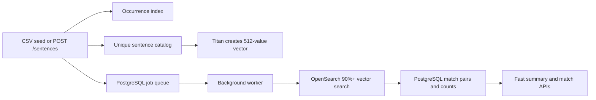

# Semantic Sentence Matching

This is a standalone application. It does not import code, configuration, or files from the entity semantic-search project.

It uses:

- OpenSearch for sentence occurrences and 512-dimension Faiss vectors.
- Amazon Titan through the registered OpenSearch model and ingest pipeline.
- SQLAlchemy with PostgreSQL for confirmed relationships, counts, summaries, and background jobs.
- A separate worker container for matching newly added sentences.

## How the data moves



The API request only saves the sentence and queues the work. The worker does
the slower vector search. The UI reads already prepared counts from PostgreSQL.

## Why PostgreSQL is included

OpenSearch finds similar sentence vectors. PostgreSQL saves the confirmed relationship so the same work does not need to run every time the UI opens.

If sentence `SENT-1001` matches `SENT-2001`, PostgreSQL stores one ordered pair. It does not store both directions. Both sentence count rows are updated, so either sentence can return the other one.

The default setting only creates matches between different applications:

```text
MATCH_ACROSS_APPLICATIONS_ONLY=true
```

Change it to `false` if sentences inside the same application should match each other.

Matching also follows these rules:

- A tracer sentence is saved in both OpenSearch indexes, so its vector is still
  available. It is marked `skipped` instead of being sent to the matching
  worker.
- A form-language sentence is handled the same way. It gets a vector but does
  not create a sentence relationship.
- Two sentences can match only when they have the same `analysisGroup`.
- Application summary and sentence-list APIs use `Asylee` when
  `analysisGroup` is not provided.

This keeps tracer and standard form text from increasing the match counts.

## OpenSearch indexes

### `sentence_occurrences`

Every CSV or API sentence is saved here.

```text
applicationId
tspId
documentId
sectionName
globalId
sentIdLocal
sentenceContent
isTracer
isFormLanguage
sentenceKey
sourceType
createdAt
updatedAt
analysisGroup
```

`sectionName` is the sentence version of `documentType`. `globalId` is the sentence ID, and `sentIdLocal` is its line number. `documentId` groups multiple sentences into one document. When it is omitted, `tspId` is used as the document ID.

### `sentence_semantic_catalog`

Only one record is saved for each normalized sentence.

```text
sentenceContent
sentenceContentVector
sentenceKey
createdAt
updatedAt
```

`sentenceContentVector` uses:

```text
dimension: 512
engine: faiss
method: hnsw
space_type: cosinesimil
```

## PostgreSQL tables

SQLAlchemy defines and creates only three tables from
`sentence_search/database_models.py`. There is no separate SQL schema file to
copy or keep in sync.

| Table | Purpose |
|---|---|
| `sentence_records` | One row per sentence. It keeps metadata, match counts, and worker status. Tracer and form-language rows use the `skipped` status. |
| `sentence_relationships` | One row per unique matching pair. Foreign keys delete relationships automatically when a sentence is removed. |
| `application_sentence_summary` | Prepared application totals and breakdowns by `sectionName` and `analysisGroup`. |

The summary table has one total row for the application, one row for each
analysis group, and smaller rows for each section inside an analysis group.
Tracer and form-language sentences are not included. The UI can therefore read
`totalMatchCount` immediately without running a relationship count during the
request.

The worker retries a failed job up to 10 times. It waits five seconds after a failure. A successful job resets its attempt counter to zero.

If this project was already started before the three-table or matching-rule
change, delete the old development volume once with
`docker compose down --volumes`, and then start the project again. Use
`reset=true` on the first new seed so the two old OpenSearch indexes are also
recreated. This deletes the old sentence data.

## Prepare the sentence embedding pipeline

The registered OpenSearch model must return 512 values and use `cosinesimil`.

Create a pipeline that maps the sentence text into the vector field:

```json
PUT /_ingest/pipeline/sentence_bedrock_embedding_pipeline
{
  "description": "Create a Titan embedding for sentence content",
  "processors": [
    {
      "text_embedding": {
        "model_id": "YOUR_DEPLOYED_MODEL_ID",
        "field_map": {
          "sentenceContent": "sentenceContentVector"
        }
      }
    }
  ]
}
```

Test the model and pipeline before starting a large seed. The model output dimension, model registration, connector, and catalog mapping must all use 512 dimensions.

## Configure the project

Edit `.env` and set:

```text
OPENSEARCH_HOST
OPENSEARCH_SEMANTIC_MODEL_ID
AWS_ACCESS_KEY_ID
AWS_SECRET_ACCESS_KEY
AWS_SESSION_TOKEN
```

Leave the AWS key values empty when the container receives credentials from an IAM task role. `IAM_ACCESS_ROLE` is optional and should only be used when this application must assume another role.

OpenSearch is not included in Docker Compose because the embedding connector and Titan model run in AWS.

## Run everything

```bash
make dev
```

Open Swagger:

```text
http://localhost:8008/docs
```

Docker starts:

- `api`: FastAPI on port 8008.
- `worker`: background sentence matching.
- `postgres`: PostgreSQL on host port 5434.

## First setup

Call:

```text
POST /admin/init
```

Then seed the sample CSV:

```json
POST /admin/seed
{
  "csvPath": "data/seed.csv",
  "reset": false
}
```

`reset=true` deletes the two OpenSearch indexes and all PostgreSQL project rows before loading the CSV.

The seed response reports queued jobs. Matching continues in the worker so the HTTP session does not need to stay open for all vector searches.

## Add one sentence

```json
POST /sentences
{
  "applicationId": "A0003",
  "tspId": "TSP-3",
  "documentId": "DOC-3",
  "sectionName": "Written Statement",
  "globalId": "SENT-3001",
  "sentIdLocal": 1,
  "sentenceContent": "The notice came from the government of the United States.",
  "isTracer": false,
  "isFormLanguage": false,
  "sentenceKey": null,
  "sourceType": "document",
  "createdAt": "2026-09-17T12:10:00Z",
  "updatedAt": "2026-09-17T12:10:00Z",
  "analysisGroup": "Asylee"
}
```

The application generates `sentenceKey`. If a key is supplied, it must match the generated SHA-256 value.

All saved relationships use `MATCH_THRESHOLD`. The default is 90%. Changing
the threshold or deployed embedding model requires `reset=true` and a full
reseed so old and new scores are not mixed.

## Read prepared counts

Application total and job status:

```text
GET /applications/A0001/summary?analysisGroup=Asylee
```

The response contains the total first, followed by the section breakdown:

```json
{
  "applicationId": "A0001",
  "analysisGroup": "Asylee",
  "totalDocuments": 12,
  "totalSentences": 1530,
  "matchedSentences": 420,
  "exactMatchCount": 95,
  "semanticMatchCount": 610,
  "totalMatchCount": 705,
  "status": "completed",
  "sectionSummaries": [
    {
      "sectionName": "Written Statement",
      "analysisGroup": "Asylee",
      "totalSentences": 350,
      "totalMatchCount": 121
    }
  ]
}
```

Application sentences, 100 per page:

```text
GET /applications/A0001/sentences?analysisGroup=Asylee&pageSize=100
```

One sentence's exact count and first 100 candidates:

```text
GET /sentences/SENT-1001/matches?pageSize=100
```

Use `nextToken` from the response as the next `nextToken` query value. PostgreSQL returns the saved total count immediately; it does not count every relationship during the request.

If `analysisGroup` is left out, both application endpoints use `Asylee`.
They return only sentences that are not tracer text and not form language.

## Delete an application or TSP document

Delete every sentence owned by an application:

```text
DELETE /applications/A0001?confirm=true
```

Delete only one TSP document inside that application:

```text
DELETE /documents/TSP-1?confirm=true
```

If a TSP ID is not globally unique, add the application safety filter:

```text
DELETE /documents/TSP-1?applicationId=A0001&confirm=true
```

Both endpoints remove occurrence documents, sentence records, relationships,
and affected summary counts. A catalog vector is deleted only when no remaining
occurrence uses its `sentenceKey`. This prevents one application from deleting
a shared vector that another application still needs.

## CSV header spelling

The preferred headers use the corrected names shown in `data/seed.csv`. For compatibility, the loader also accepts these names from the original description:

```text
application_Id
local_globa_id
senetence_content
```

They are converted internally to:

```text
applicationId
sentIdLocal
sentenceContent
```

The loader reads the CSV from top to bottom. It does not sort by a sentence ID or line number.

## Remove everything

```text
DELETE /admin/storage?confirm=true
```

This deletes both OpenSearch physical indexes and aliases and truncates all PostgreSQL project tables. The Docker PostgreSQL volume remains until `make clean` is run.
