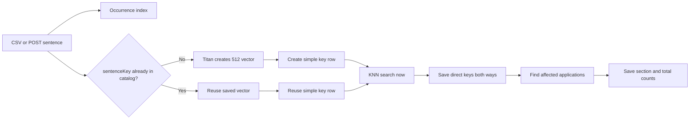

# Semantic Sentence Matching

This folder is one complete application. It does not import code from another
project.

The job is simple:

1. Save every sentence in OpenSearch.
2. Create one Titan vector for each new sentence text.
3. Find direct sentence-key matches during ingestion.
4. Save both directions in PostgreSQL.
5. Save application and section totals in PostgreSQL.
6. Let the UI read totals immediately and page through sentence details.

Titan and KNN are used only while adding data. The two UI search endpoints do
not call Titan and do not run KNN.

## Storage

The project has two OpenSearch indexes and two PostgreSQL tables.

### OpenSearch occurrence index

`sentence_occurrences` stores every sentence record:

```text
applicationId, tspId, sectionName, globalId, sentIdLocal,
sentenceContent, isTracer, isFormLanguage, sentenceKey, sourceType,
createdAt, updatedAt, analysisGroup
```

The `globalId` is the OpenSearch document ID.

### OpenSearch catalog index

`sentence_semantic_catalog` stores one record for each unique `sentenceKey`:

```text
sentenceContent, sentenceContentVector, sentenceKey, createdAt, updatedAt
```

The vector is 512 dimensions. The mapping uses Faiss, HNSW, and cosine
similarity.

### PostgreSQL table 1: `sentence_key_matches`

This table stores the direct key graph:

```text
sentenceKey
matchingSentenceKeys
createdAt
updatedAt
```

The matching-key array has a PostgreSQL GIN index so deleting a key does not
need a full table scan.

PostgreSQL does not copy sentence records. Those records stay in OpenSearch.

### PostgreSQL table 2: `application_match_summary`

This table stores the answer the UI needs immediately:

```text
applicationId
analysisGroup
sectionMatchCounts
totalMatching
updatedAt
```

Example:

```text
Affidavit -> 10 matches
B1        -> 30 matches
Total     -> 40 matches
```

This is only a saved result table. It does not contain worker or queue fields.

## Why we save sentence keys, not global IDs

The same sentence text can exist under many `globalId` values. Its normalized
text always creates the same SHA-256 `sentenceKey`.

If the key already exists, the application reuses its vector. Updating the
same direct relationship is safe because duplicate keys are removed.

Example:

```text
key D directly matches key A and key B

D -> [A, B]
A -> [D]
B -> [D]
```

The save is bidirectional. If D stores A, A also stores D.

The code saves direct matches only. It does not make a false connected group.
If A matches B and A matches D, that alone does not say B matches D.

## Ingestion flow



For one matchable key, ingestion does this:

1. Read the saved vector from the catalog.
2. KNN search the catalog at the configured threshold.
3. Keep direct keys that pass the threshold.
4. Update the source key and reverse key lists in one PostgreSQL transaction.
5. Find applications using those keys.
6. Calculate and save complete section and application totals.

CSV seeding uses small parallel waves:

```text
SEED_BATCH_SIZE=100
SEED_WORKERS=4
```

Each worker can send one 100-record catalog batch through the Titan pipeline.
`SEED_WORKERS` can be set from 1 through 16. After one wave finishes, the API
saves its occurrence records, refreshes OpenSearch once, matches its unique
sentence keys with the same worker pool, and refreshes the affected application
summaries.

If Titan or the Lasso proxy returns a temporary 408, 429, or 5xx error, every
catalog worker pauses for five seconds. Only failed catalog records are sent
again, up to ten attempts. A permanent 400 error stops the seed immediately.
Every retry is printed as a warning with its attempt number, failed document
count, wait time, and error. A permanent or final failure prints its full error
before the seed endpoint returns the failure response.

The API returns only after matching and summary updates finish. If ingestion
fails, send that sentence or seed request again. The relationship writes are
safe to repeat.

Tracer and form-language sentences are still indexed and still receive a
vector. They are not used for matching. Read queries always filter both flags
to false.

The saved key relationship is not tied to an analysis group. The read query
filters occurrences to the requested `analysisGroup`, which defaults to
`Asylee`.

## Application semantic summary

Request:

```text
GET /applications/A0001/sentences/semantic-summary?analysisGroup=Asylee&pageSize=100
```

This returns up to 100 eligible application sentences. Each sentence has:

```text
exactMatchCount
similarMatchCount
totalMatchCount
directMatchingKeyCount
```

`exactMatchCount` means the same `sentenceKey` exists outside the supplied
application. `similarMatchCount` means an occurrence uses one of the saved
direct matching keys. Both counts use the same analysis group and ignore tracer
and form-language records.

The top of the response comes directly from `application_match_summary`:

```text
totalMatching
sectionMatches
summaryUpdatedAt
```

Example response:

```json
{
  "applicationId": "A0001",
  "analysisGroup": "Asylee",
  "thresholdPercentage": 90,
  "totalMatching": 4512,
  "sectionMatches": [
    {"sectionName": "Affidavit", "matchingCount": 1812},
    {"sectionName": "B1", "matchingCount": 2700}
  ],
  "summaryUpdatedAt": "2026-09-18T14:30:00Z",
  "totalSentences": 1530,
  "returnedSentences": 100,
  "pageMatchingSentences": 82,
  "pageTotalMatches": 421,
  "pagination": {
    "page": 1,
    "pageSize": 100,
    "totalPages": 16,
    "hasPreviousPage": false,
    "hasNextPage": true
  },
  "nextToken": "TOKEN_FROM_THE_API",
  "sentences": [
    {
      "globalId": "SENT-1",
      "sentenceKey": "SHA256_KEY",
      "sentenceContent": "The government issued the notice.",
      "exactMatchCount": 2,
      "similarMatchCount": 4,
      "totalMatchCount": 6,
      "directMatchingKeyCount": 3
    }
  ],
  "neuralSearchUsed": false
}
```

`totalMatching` is ready before sentence pagination starts. It is the sum of
all exact and direct semantic occurrence matches outside the application.
`sectionMatches` splits the same number by section.

The first page gets `totalSentences` from OpenSearch. Later pages carry that
number inside `nextToken`, so OpenSearch does not recount it. Per-sentence
counts are calculated only for the 100 sentences on the current page.

Use the returned token without changing `applicationId`, `analysisGroup`, or
`pageSize`:

```text
GET /applications/A0001/sentences/semantic-summary?analysisGroup=Asylee&pageSize=100&nextToken=TOKEN_FROM_THE_API
```

## Search by sentence key

Request:

```text
GET /applications/A0001/sentences/semantic-search?sentenceKey=SHA256_KEY&analysisGroup=Asylee&pageSize=100
```

This endpoint does not turn text into a vector. The caller sends a
`sentenceKey` that already exists.

The API reads that key's direct matching keys from PostgreSQL. It then sends a
normal OpenSearch `terms` query for the source key plus those direct keys. The
current application is left out.

Example response:

```json
{
  "applicationId": "A0001",
  "analysisGroup": "Asylee",
  "sentenceKey": "SHA256_KEY",
  "thresholdPercentage": 90,
  "directMatchingKeyCount": 3,
  "exactMatchCount": 2,
  "similarMatchCount": 4,
  "totalMatches": 6,
  "returnedMatches": 6,
  "pagination": {
    "page": 1,
    "pageSize": 100,
    "totalPages": 1,
    "hasPreviousPage": false,
    "hasNextPage": false
  },
  "nextToken": null,
  "matches": [
    {
      "applicationId": "A0002",
      "globalId": "SENT-99",
      "sentenceKey": "SHA256_KEY",
      "sentenceContent": "The government issued the notice.",
      "matchType": "exact"
    }
  ],
  "neuralSearchUsed": false
}
```

The first request calculates the complete exact and similar count. Those
counts are carried in `nextToken`, so later pages do not count again. The token
also checks that the saved direct-key list did not change between pages. If a
new ingestion changes the relationship list, start again from the first page.

## Titan pipeline

The deployed OpenSearch model must return 512 values.

```json
PUT /_ingest/pipeline/sentence_bedrock_embedding_pipeline
{
  "description": "Create a Titan embedding for sentence content",
  "processors": [
    {
      "text_embedding": {
        "model_id": "YOUR_DEPLOYED_MODEL_ID",
        "field_map": {
          "sentenceContent": "sentenceContentVector"
        }
      }
    }
  ]
}
```

The Titan connector, registered model, ingest pipeline, and index mapping must
all agree on 512 dimensions.

## Configure and run

Copy `.env.example` to `.env`, then fill these values:

```text
OPENSEARCH_HOST
OPENSEARCH_SEMANTIC_MODEL_ID
AWS_ACCESS_KEY_ID
AWS_SECRET_ACCESS_KEY
AWS_SESSION_TOKEN
SEED_WORKERS
```

Leave AWS keys empty when the container receives an IAM role.

Run the API and PostgreSQL:

```text
make dev
```

Run only PostgreSQL in Docker:

```text
make postgres
```

Swagger:

```text
http://localhost:8008/docs
```

Initialize storage:

```text
POST /admin/init
```

Initialization also upgrades an earlier project table in the Docker volume by
removing the old worker and queue columns.

Seed from Swagger:

```text
POST /admin/seed?reset=false&csvPath=data%2Fseed.csv
```

`reset=false` keeps old data and reuses existing keys. `reset=true` deletes the
two OpenSearch indexes and clears both PostgreSQL tables before seeding.
For data that was loaded before `application_match_summary` was added, seed the
same file with `reset=false`. Existing vectors are reused and the missing
summary rows are calculated.

Add one sentence:

```json
POST /sentences
{
  "applicationId": "A0003",
  "tspId": "TSP-3",
  "sectionName": "Affidavit",
  "globalId": "SENT-3001",
  "sentIdLocal": 1,
  "sentenceContent": "The notice came from the United States government.",
  "isTracer": false,
  "isFormLanguage": false,
  "sentenceKey": null,
  "sourceType": "document",
  "createdAt": null,
  "updatedAt": null,
  "analysisGroup": "Asylee"
}
```

## Delete data

Delete one application:

```text
DELETE /applications/A0001?confirm=true
```

Delete one TSP document:

```text
DELETE /documents/TSP-1?applicationId=A0001&confirm=true
```

The API deletes occurrence records first. A catalog vector and PostgreSQL key
row are deleted only when no remaining occurrence uses that key. The deleted
key is also removed from surviving direct-match lists. Every affected
application summary is refreshed, and a fully deleted application's summary
rows are removed.

Delete all project data:

```text
DELETE /admin/storage?confirm=true
```

## Helpful endpoints

```text
GET  /health
GET  /stats
GET  /index-documents?index=sentence_occurrences&count=10
```

Choose the catalog alias in `/index-documents` to include the complete
512-number `sentenceContentVector` list for each returned catalog record.

Run tests:

```text
make test
```
